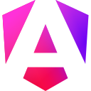

# やら ゆうと (s20024)

プログラマー(実務)歴3年の初心者フロントエンドエンジニアです。  
たまにバックエンドもしています。

[<code></code>](https://x.com/s20024itcollege)
[<code></code>](mailto:s20024@std.it-college.ac.jp)

> このアカウントは`勉強用アカウント`です。  
> `仕事用アカウント`は[@Yuto-Yara](https://github.com/Yuto-Yara)になります。  
> ※ 2025の中旬からGit管理を徐々に、Githubに移行していってます。

## 現在の学習内容/目標

- フルスタックエンジニアを目標にし、基礎力を底上げする
  - インフラ周りがまだ知識が浅いのでそこを重点的に学習中
- フロントエンドは、`綺麗な目を引く`Webサイトを作成できるように、UI/UXの知識を深める
- 仕様駆動/テスト駆動の学習をし、仕事で実践できるようにする

## 技術スタック

#### **Languages**

<code></code>
<code></code>
<code></code>
<code></code>
<code></code>
<code></code>  
実務経験浅い/趣味:
<code></code>
<code></code>
<code></code>
<code></code>

#### **Frameworks / Libraries**

<code></code>
<code></code>
<code></code>
<code></code>
<code></code>
<code></code>  
実務経験浅い/趣味:
<code></code>
<code></code>
<code></code>
<code></code>
<code></code>
<code></code>
<code></code>

#### **Tools**

<code></code>
<code></code>
<code></code>
<code></code>
<code></code>
<code></code>
<code></code>
<code></code>
<code></code>

## Products

### [<code></code>s20024's Plog](https://plog.s20024.com)

ただの技術ブログ?日常ブログ?個人メモ?です。※`Programng + Blog = Plog`です。  
[チャット](https://plog.s20024.com/chat)にて下記↓↓にて記載しているMCPを利用したAIAgentと会話ができます。気になる方はご利用してみてください。※僕の紹介を「ずんだもん」が行ってくれます。

### [<code></code>ProfileMcp](https://backend.s20024.com/mcp/profile)

MCPのurlは「`https://backend.s20024.com/mcp/profile`」です。  
AIを通して`うちの会社は主にPHPで開発を行っていますが、屋良さんはうちの会社に向いていますか？`のように質問してみてください。

### [<code></code>Junks](https://s20024.github.io/Junks)

Junksは、「勉強の合間に作成したもの」や「学生の頃に作成した作品」、「もう利用しなくなったサイト」などを残しておく用のいわゆる`ガラクタ置き場`になります。  
それぞれ動作する状況で、これまでの作品を置いておく場として作成しています。

## 仕事用アカウント ([Yuto-Yara](https://github.com/Yuto-Yara))

